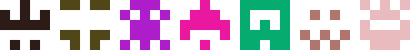
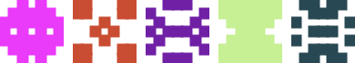
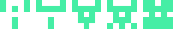

Icodi - Deterministic Random SVG Icon Generator
==================================================

[](https://badge.fury.io/rb/icodi)
[](https://travis-ci.com/DannyBen/icodi)

---

Generate repeatable random SVG icons from any string, similar to 
[GitHub identicons].

---

Installation
--------------------------------------------------

    $ gem install icodi


Examples
--------------------------------------------------

### Grid: 5x5, Mirror: X (default options)



### Grid: 6x6, Mirror: Y, Stroke: 4


### Grid: 8x8, Stroke: 7, Density: 0.3


### Grid: 7x7, Mirror: X/Y, Stroke: 3, Density: 0.8



### Increasing Stroke: 0.1 - 5.0


### Increasing Density: 0.3 - 0.8



### Mirror Styles: X, Y, Both, None


Usage
--------------------------------------------------

This is the general usage pattern:

```ruby
require 'icodi'

# initialize with optional text and options
icon = Icodi.new text, options

# get the SVG string
icon.render

# or save to SVG file
icon.save 'logo'
```

Generate a random icon with the default options, and save it to `icon.svg`:

```ruby
icon = Icodi.new
icon.save 'icon'
```

Generate persistent random icon (same input generates the same output):

```ruby
icon = Icodi.new "any string"
icon.save 'icon'
```

Options
--------------------------------------------------

Options can be provided as the first or second argument:

```ruby
Icodi.new "any string", pixels: 8, density: 0.3
Icodi.new pixels: 8, density: 0.3, stroke: 2
```

Parameter   | Default    | Type    | Description
------------|------------|---------|---------------------
`pixels`    | `5`        | Integer | Grid size.
`mirror`    | `:x`       | Symbol  | Mirroring mode: `:x`, `:y`, `:both` or `:none`.
`color`     | Deterministic Random  | String | A color string for the pixels.
`density`   | `0.5`      | Float   | A value between 0 and 1 representing the chance for a pixel to be drawn. Lower values mean less pixels.
`stroke`    | `0.1`      | Float   | Width of the border around each pixel. Note that each pixel is a 10x10 box, so a stroke of 1 means it will take 10% of the box. Higher values generate more overlap between the pixels.
`background`| `#fff`     | String  | A named SVG color string (`blue`, `yellow` etc.) or RGB color (for example `#dddddd`).
`template`  | `:default` | Symbol/String | SVG template to use. Can be `:default`, `:html` or a path to a file. Read more on [Victor SVG Templates].

---

[GitHub identicons]: https://blog.github.com/2013-08-14-identicons/
[Victor SVG Templates]: https://github.com/DannyBen/victor#svg-templates
