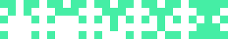

Icodi - Deterministic Random SVG Icon Generator
==================================================

[](https://badge.fury.io/rb/icodi)
[](https://github.com/DannyBen/icodi/actions?query=workflow%3ATest)
[](https://codeclimate.com/github/DannyBen/icodi/maintainability)

---

Generate repeatable random SVG icons from any string, similar to 
[GitHub identicons].

---

Table of Contents
--------------------------------------------------

- [Installation](#installation)
- [Demo](#demo)
- [Examples](#examples)
- [Usage](#usage)
- [Options](#options)
- [Using with Sinatra](#using-with-sinatra)
- [Contributing / Support](#contributing--support)


Installation
--------------------------------------------------

    $ gem install icodi


Demo
--------------------------------------------------

Visit the [Icodi Playground] to experiment with the parameters (may take a 
few minutes to boot).


Examples
--------------------------------------------------

### Grid: 5x5, Mirror: X (default settings)


### Grid: 6x6, Mirror: Y, Stroke: 4


### Grid: 8x8, Stroke: 7, Density: 0.3


### Grid: 7x7, Mirror: X/Y, Stroke: 3, Density: 0.8


### Grid: 5x5, Jitter: 0.9, Stroke: 2


### Increasing Stroke: 0.1 - 5.0


### Increasing Density: 0.3 - 0.8



### Increasing Jitter: 0 - 1.0


### Mirror Styles: X, Y, Both, None


Usage
--------------------------------------------------

This is the general usage pattern:

```ruby
require 'icodi'

# initialize with optional text and options
icon = Icodi.new text, options

# get the SVG string
icon.render

# or save to SVG file
icon.save 'logo'
```

Generate a random icon with the default options, and save it to `icon.svg`:

```ruby
icon = Icodi.new
icon.save 'icon'
```

Generate persistent random icon (same input generates the same output):

```ruby
icon = Icodi.new "any string"
icon.save 'icon'
```

Options
--------------------------------------------------

Options can be provided as the first or second argument:

```ruby
Icodi.new "any string", pixels: 8, density: 0.3
Icodi.new pixels: 8, density: 0.3, stroke: 2
```

Parameter   | Default    | Type    | Description
------------|------------|---------|---------------------
`pixels`    | `5`        | Integer | Grid size.
`mirror`    | `:x`       | Symbol  | Mirroring mode: `:x`, `:y`, `:both` or `:none`.
`color`     | Deterministic Random | String | A color string for the pixels.
`density`   | `0.5`      | Float   | A value between 0 and 1 representing the chance for a pixel to be drawn. Lower values mean less pixels.
`stroke`    | `0.1`      | Float   | Width of the border around each pixel. Note that each pixel is a 10x10 box, so a stroke of 1 means it will take 10% of the box. Higher values generate more overlap between the pixels.
`jitter`    | `0`        | Float   | A value between 0 and 1 representing the chance for a pixel to be dislocated by half of its size in a random direction.
`background`| `#fff`     | String  | A named SVG color string (`blue`, `yellow` etc.) or RGB color (for example `#dddddd`).
`id`        | `icodi`    | String  | The ID to assign the SVG object. Normally this should not matter, but if you intend to embed this icon in an HTML, or in another SVG, this can be useful.
`template`  | `:default` | Symbol/String | SVG template to use. Can be `:default`, `:html` or a path to a file. Read more on [Victor SVG Templates].

---


Using with Sinatra
--------------------------------------------------

To create a Sinatra server that serves Icodi images, see the 
[config.ru](config.ru) example code.


Contributing / Support
--------------------------------------------------

If you experience any issue, have a question or a suggestion, or if you wish
to contribute, feel free to [open an issue][issues].

---

[GitHub identicons]: https://blog.github.com/2013-08-14-identicons/
[Victor SVG Templates]: https://github.com/DannyBen/victor#svg-templates
[Icodi Playground]: http://icodi.dannyb.co/sandbox
[issues]: https://github.com/DannyBen/icodi/issues
